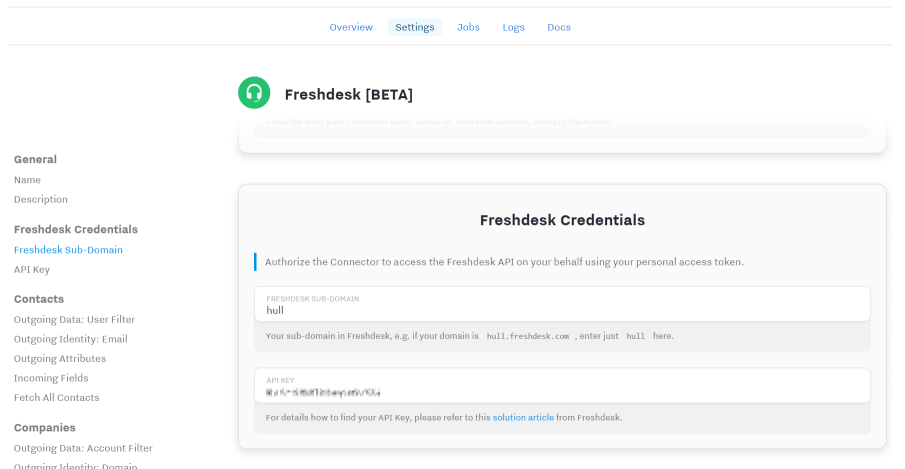
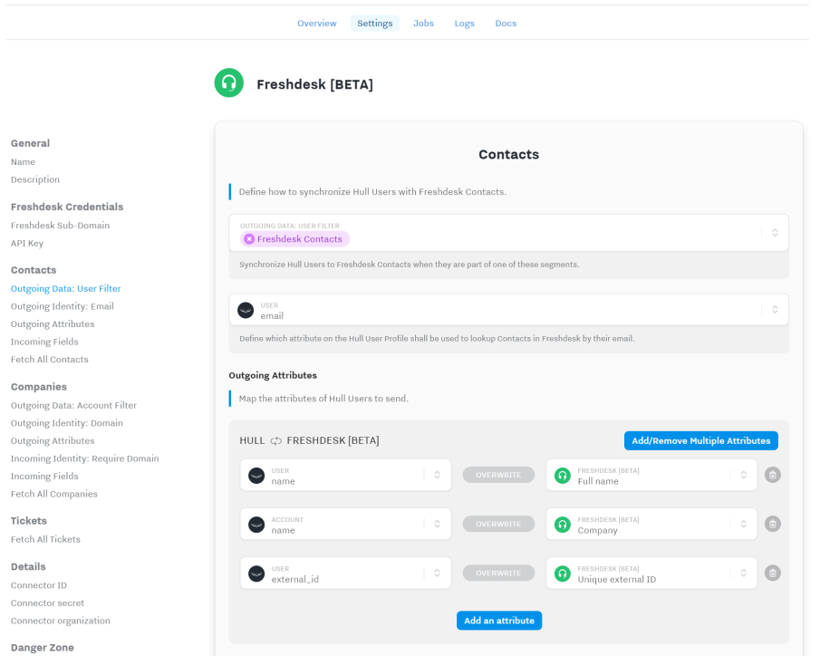
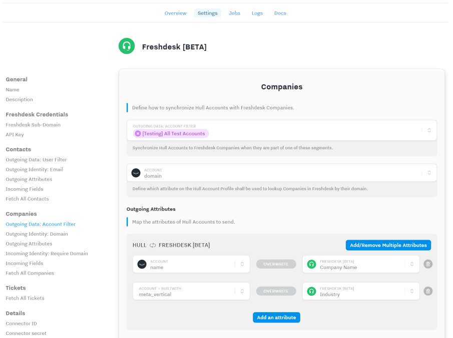
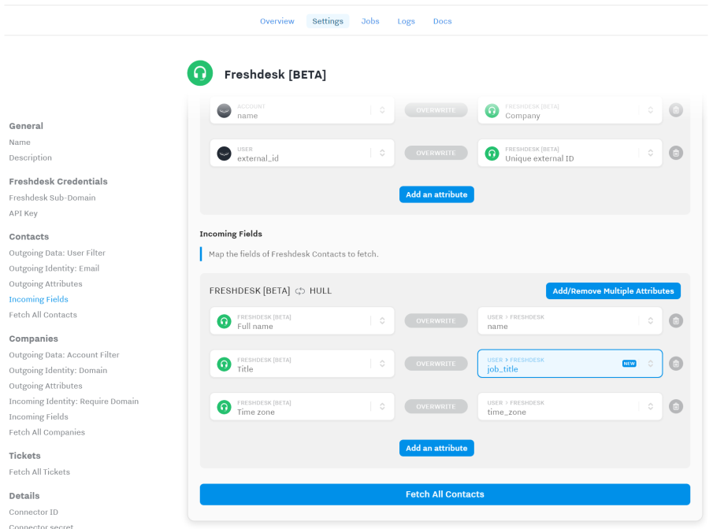
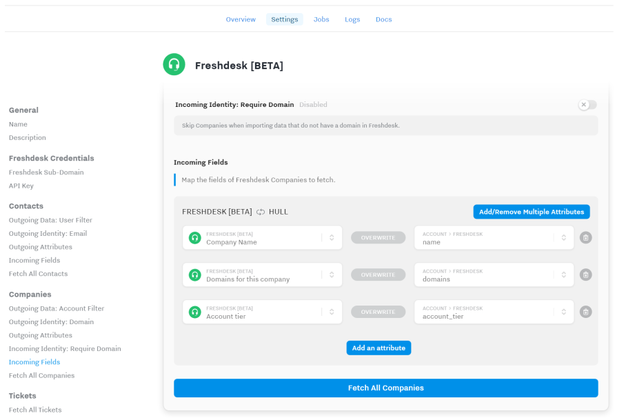
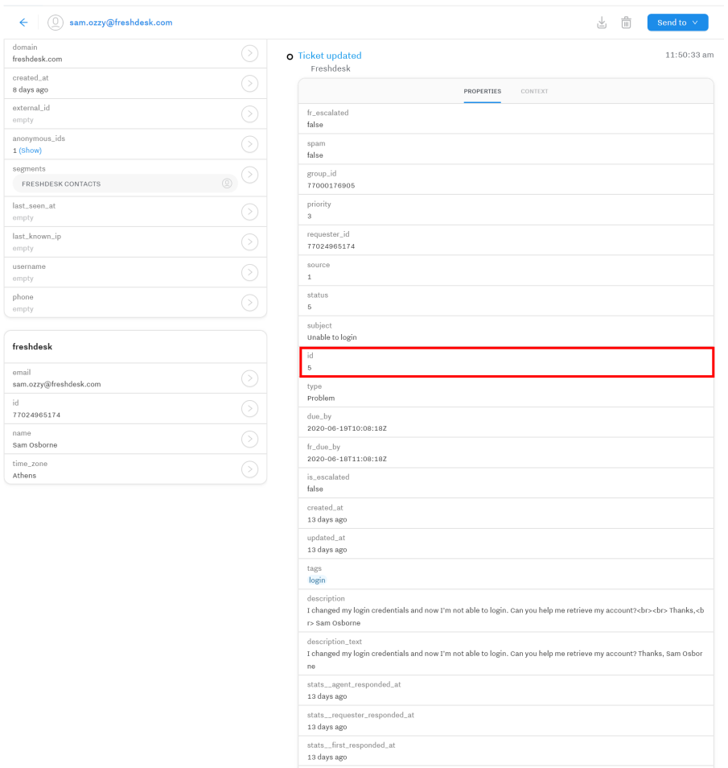
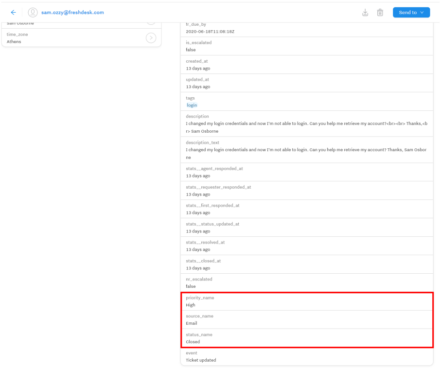

# Hull Freshdesk Connector

This Connector enables you to synchronize Hull users and accounts to Freshdesk contacts and companies and also allows you to track tickets in Hull as User events.

This document was last updated on July 1, 2020. If you want to help us improve this documentation or have some feedback, please feel free to [open a GitHub issue](https://github.com/hull/hull-freshdesk/issues/new)!

## Getting Started

1. From your Hull Connectors page click on `[Add a Connector]`
2. Search for "Freshdesk" and click on `[Install]`
3. Authorize Hull to send data on your behalf by configuring the Freshdesk Credentials section:
   

   Please refer to this [solution article](https://support.freshdesk.com/support/solutions/articles/215517) from Freshdesk for further details.

## Control outgoing data flow

### User data from Hull to Contacts in Freshdesk

You can synchronize user attributes from Hull with Freshdesk Contacts by specifying one or more user segments in the `Outgoing Data: User Filter` and configuring the required mappings under `Outgoing Attributes`:

Futhermore you can control how the Connector finds matching Contacts in Freshdesk by configuring `Outgoing Identity: Email`. By default the built-in attribute `email` is used. If the Connector doesn't find a matching Contact in Freshdesk with the email provided, it will automatically create a new one. In case a matching Contact is found, this Contact will be updated.

_Note_: If you are using `external_id` in Hull, you should map the field in `Outgoing Attributes` to the `Unique external ID` in Freshdesk. The Freshdesk API doesn't allow to look up Contacts by this field, so the Connector cannot use it to find a matching Contact.

### Account data from Hull to Companies in Freshdesk

You can synchronize account attributes from Hull with Freshdesk Companies by specifying one or more account segments in the `Outgoing Data: Account Filter` and making the required mappings under `Outgoing Attributes`:

Furthermoe you can control how the Connector finds matching Companies in Freshdesk by specifying `Outgoing Identity: Domain`. By default the built-in attribute `domain` is used. Companies in Freshdesk can have multiple domains, the Connector will match all domains of a given Company to determine whether one exists or a new one needs to be created. If the Connector doesn't find a matching Company in Freshdesk with the domain provided, it will automatically create a new one. In case a matching Contact is found, this Contact will be updated.

_Note_: The account must be in one of the whitelisted segments. The Connector won't synchronize a linked account based on the fact that the user matches a whitlisted segment in the `Outgoing Data: User Filter`.

### Control Incoming Data Flow

#### Fetching of Contacts

The Connector fetches Freshdesk Contact data on a scheduled interval of 5 minutes, and you can configure the attributes to fetch in the Settings section `Incoming Fields` as shown below:

_Pro Tip:_ If you add a new mapping to the `Incoming Fields` section, click on the `[Fetch All Contacts]` button to retrieve he newly mapped attribute from Freshdesk, otherwise the data won't become available until the Contact is marked as updated by Freshdesk.

#### Fetching of Companies

The Connector fetches Freshdesk Company data on a scheduled interval of 30 minutes due to the fact that the Freshdesk API allows only a daily resolution on filtering for changed companies. You can be configure the attributes to retrieve in the section `Incoming Fields`:

Since the domain is not a mandatory field in Freshdesk, the Connector allows you to opt out of fetching Companies without a domain into Hull. If you elect to opt out, you can activate the toggle at `Incoming Identity: Require Domain`.

Since there is no granular change detection on the Freshdesk API, the Connector performs a fetch of all companies which have been updated within the current day and filters internally for companies being changed since the last synchronization start (30 minutes ago). This reduces the amount of incoming request in Hull, which is a billable metric.

_Pro Tip:_ If you add a new mapping to the `Incoming Fields` section, click on the `[Fetch All Companies]` button to retrieve he newly mapped attribute from Freshdesk, otherwise the data won't become available until the Company is marked as updated by Freshdesk.

#### Fetching of Tickets

The Connector fetches Freshdesk Ticket data on a scheduled interval of 5 minutes. There is no mapping required, all ticket fields from Freshdesk are automatically transformed into properties of the Hull event.

The Connector emits two distinct events for tickets on the user timeline in Hull: `Ticket created` and `Ticket updated`.
The determination of which event is emitted, is made by comparing the `created_at` and `updated_at` properties which the Freshdesk API returns. If both are equal, the connector will emit a `Ticket created` event, otherwise `Ticket updated`.

The connector allows you to retrieve historical tickets from Fresdesk by clicking on the button `[Fetch All Tickets]`. In this case the Connector will retrieve all tickets, but due to API limitations will only reflect the latest state of each ticket and **only** emit `Ticket updated` events.

Every event contains the Ticket ID from Freshdesk as a property, so you can use this to correlate events:

Furthermore the Connector automatically translates the numerical identifiers for priority, source and status into a human readable format:

## FAQ

### Why can I not use the external ID for Contacts to find existing Contacts in Freshdesk

The Freshdesk API only allows filtering of Contacts by email, so the Connector cannot use the `external_id`. If you have mapped it in `Outgoing Attributes` to the `Unique external ID` in Freshdesk, the synchronization will fail and you get a `outgoing.user.error` log with the details. In this case you need to correct either the email in Hull or Freshdesk to resume synchronization of the user/contact.

### Why are there two different intervals for fetching data from Freshdesk

The Freshdesk API allows only a daily granularity when querying for Companies which have been updated. This means every API call returns a lot of data and the Connector needs to filter out the real changes since the last synchronization internally. To avoid running into API rate limiting on Freshdesk and to reduce the amount of work for the Connector, companies are only synchronized every 30 minutes. Contact and Ticket data is fetched every 5 minutes.

### Where can I find the changelog for the Connector

You can find the changelog on GitHub detailing what features have been added, what bugfixes have been applied and what technical maintenance measures have been taken: [Changelog](https://github.com/hull/hull-freshdesk/blob/master/CHANGELOG.md).
